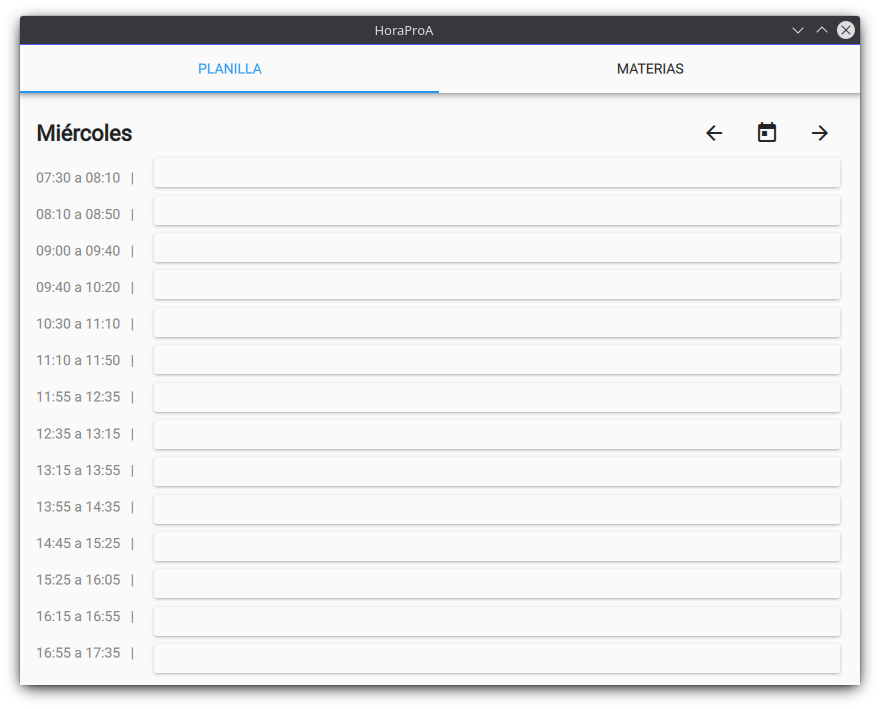
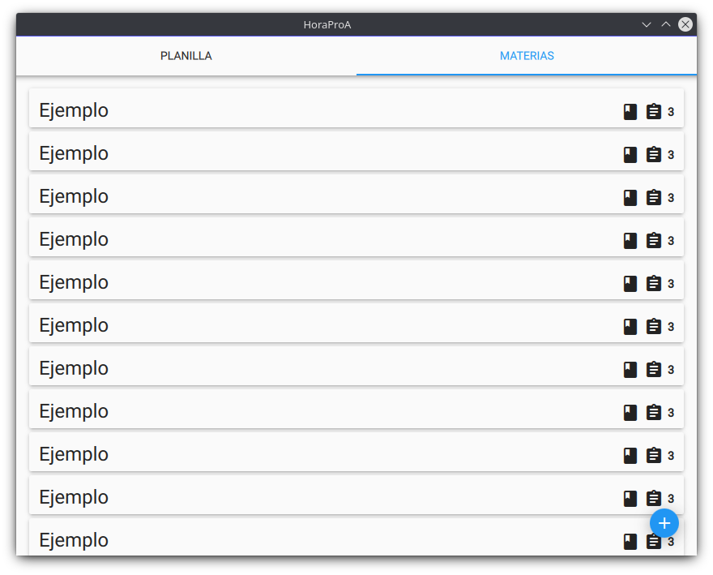

# HoraProA: Una planilla de horarios y administrador de tareas escolar

> Aviso: HoraProA **no está relacionado o asociado** al proyecto _Escuelas ProA_

> Este proyecto todavía se encuentra en desarrollo

HoraProA es una herramienta de productividad para manejar tu tiempo y tareas relacionadas a la escuela.

Actualmente, la planilla de horarios está pensada para usar en escuelas secundarias técnicas, pero está planeado expandirlo para usarse en otras escuelas

# Funciones

## Planilla de horarios



Una planilla flexible dividida en modulos. Puede exportarla y compartirla con amigos, o con sus alumnos

## Tareas



Anote sus tareas con su fecha de entrega, divididas en materias

## Multiplataforma

HoraProA es compatible con PCs y Móviles.

# Instalación

Para poder usar HoraProA es necesario compilarlo

## Linux

**Dependencias:**

- Librerías escenciales para C++
- CMake
- Make
- Qt5 Quick Controls 2
- Qt5 Graphical Effects

**Compilación**:

```bash
mkdir build
cd build
cmake ..
make
```
## Android

**Requerimientos:**

- Qt 5.12+ compilado para arm
- Android SDK
- Android NDK
- Python 3

**Compilación:**

Utilize el script `build-android.py`.  
`./build-android.py --help` para más información.

## Windows

Use [Qt Creator](https://www.qt.io/download) para compilarlo.

## macOS y iOS

No está planeado
